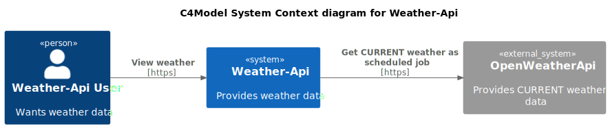

# Weather-Api


This application provides weather information for predefined locations. This repository contains the frontend and
backend service. In production the backend connects to the hosts PostgreSQL database.
Proxy routing to these services is handled by another private infrastructure service.

The Weather-Api backend requests the public OpenWeatherApi once a minute for the current weather data. The response data is stored
in the database. Frontend and backend Api can be reached by internet in with https.

The weather data is displayed on charts in the ReactJs frontend.

This Readme holds extensive information on the backend service. Please note that there is also
a [frontend Readme](frontend/README.md).

Link to production UI. [https://oskar-westmeijer.com/weather](https://oskar-westmeijer.com/weather)

## Technologies used

```
- Java, Maven & Spring-Boot
- Spring Data JPA & Liquibase 
- Lombok, Mapstruct & OpenApi Generator 
- PostgreSQL, Testcontainers, Wiremock & Prometheus
- Nginx & ReactJS
- Github Actions, Docker and Docker-Compose
```

## Local development

### Build & test

This projects uses testcontainers. It will automatically inject the required resources to the started containers.

```
./mvnw clean verify
```

### Run application

Docker-compose initializes the dependencies on startup. There will be no connections to actual production systems.
Wiremock mocks the OpenWeatherApi requests. Use the correct docker-compose template!

```
docker-compose up -d
./mvnw spring-boot:run 
```

### OpenApi docs

The Api specification files are located in this directory `src/main/resources/openapi`. The Controller interfaces and related response
models are generated at compile phase.

After startup the OpenApi documentation can be reached at these urls.

Json api-docs

- http://localhost:8080/v3/api-docs
- https://oskar-westmeijer.com/v3/api-docs (production)

Swagger UI using the Json api-docs

- http://localhost:8080/swagger-ui/index.html
- https://oskar-westmeijer.com/swagger-ui/index.html (production)

## Deployment

### Release image

The image will be released by Github actions. Every push (merge) to main will trigger a build & release.

## Documentation

A couple c4-model diagrams describe the architecture.
Furthermore, the deployed Weather-Api frontend(https://oskar-westmeijer.com/weather/documentation) hosts a documentation
section with more details.

### c4-model System context diagram



### c4-model Container diagram

