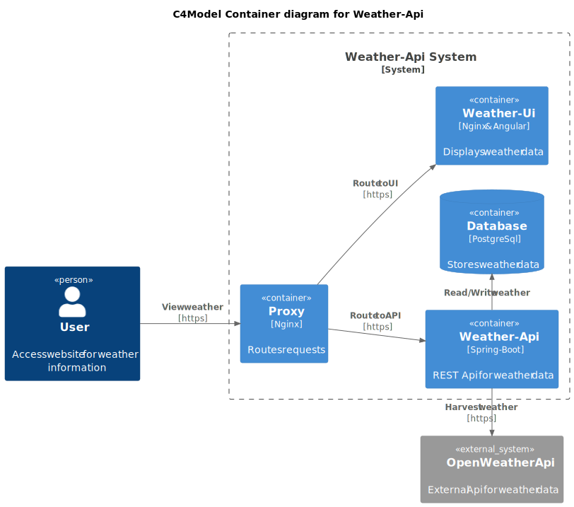

# Weather


[](https://codecov.io/gh/OskarWestmeijer/weather)
[](https://uptime.betterstack.com/?utm_source=status_badge)

Provides weather data for selected locations. The frontend displays the weather in charts. The backend service offers a public
Api. The weather data is harvested every minute from `openweathermap.org`. The information is stored in a database. Furthermore the Api is
documented with an OpenApi specification.

- [https://weather.oskar-westmeijer.com](https://weather.oskar-westmeijer.com) (Angular frontend)
- [https://api.weather.oskar-westmeijer.com](https://api.weather.oskar-westmeijer.com) (Spring Boot backend)

### Technologies

```
- Java, Maven & Spring-Boot
- Lombok, Mapstruct & OpenApi Generator
- Spring Data JPA & Liquibase
- Testcontainers & Wiremock
- Nginx & Angular
- Github Actions, Docker & PostgreSQL
```

### Build & Test

This projects uses the library Testcontainers. The Integration-Test dependencies will be automatically started.

``` bash
# ensure docker is running
./mvnw clean verify
```

### Run application

Docker Compose mocks all external system dependencies, there are no connections to actual production systems.
Wiremock mocks the OpenWeatherApi harvesting source.

``` bash
docker compose up -d
./mvnw spring-boot:run
```

## OpenApi Generator

This project uses OpenApi code-generator. The Controller interfaces, external web client and response models are generated at compile phase.

#### Server (this Weather-Api)

The public Api definition is documented with Redoc. Open the file in a browser, or navigate there after startup application startup.

`src/main/resources/public/weather-api.yml`

- http://localhost:8080
- https://api.oskar-westmeijer.com

#### Client (external OpenWeatherApi)

The client OpenApi specification is for internal usage only and therefore located in a separate directory.

`src/main/resources/openapi/openweatherapi.yml`

## Architecture


