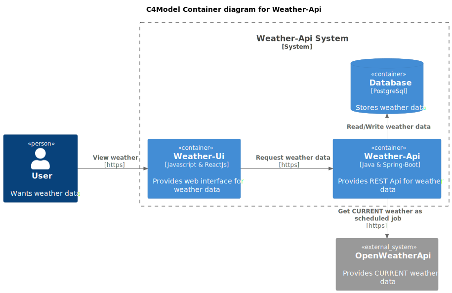

# weather-api

This app requests the OpenWeatherApi every minute for current weather data. It fetches information for several cities.

The setup contains a postgres database, where the data is stored after each request. Everything is dockerized.

The weather data is displayed in a ReactJs UI. Furthermore the API is directly accessable via REST.

### technologies used

```
- Java
- Maven
- Spring-Boot
- Hibernate
- ReactJS
- Docker and docker-compose
- PostgreSQL
- Testcontainers & Wiremock
- OpenWeatherApi (Api access)
```

### c4-model

#### system context diagram


#### container diagram



### build & test

This projects uses testcontainers with pre initialized data.

```
./mvnw clean verify
```

### how-to run on local machine

Docker compose initializes the database on startup.

```
docker-compose -f cdev.yml up -d
./mvnw spring-boot:run
```

### release image

Build a new target folder. Publish image to Dockerhub. Remember to increase the tag version in the compose-prod.yml

```
./mvnw clean package
docker build -t oskarwestmeijer/weather-api:1.4.3 .
docker push oskarwestmeijer/weather-api:1.4.3
```

### deployment

```
ssh on Server

pull https://github.com/OskarWestmeijer/weather-api

docker-compose -f cprod.yml down
docker-compose -f cprod.yml up -d
```

#### .env file

The application folder on the server contains a .env file. This contains api-keys and database credentials.