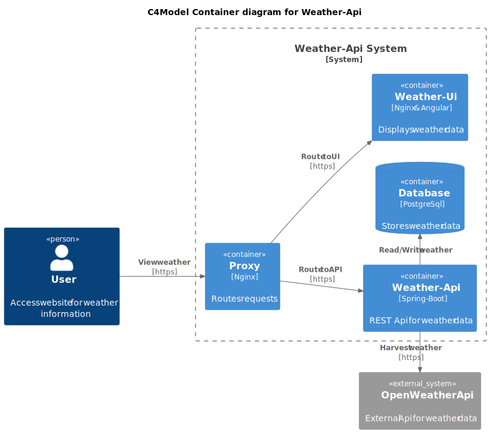

# Weather


[](https://codecov.io/gh/OskarWestmeijer/weather)
[](https://uptime.betterstack.com/?utm_source=status_badge)

Provides weather data for selected locations. Offers public frontend UI and Rest API. The weather
data is harvested by a import-job from `openweathermap.org` and stored in a database. Furthermore,
the Api is documented with an OpenApi specification.

- [https://weather.oskar-westmeijer.com](https://weather.oskar-westmeijer.com) (Angular frontend)
- [https://api.weather.oskar-westmeijer.com](https://api.weather.oskar-westmeijer.com) (Spring Boot
  backend)

### Technologies

```
- Java, Maven & Spring-Boot
- Lombok, Mapstruct & OpenApi Generator
- Spring Data JPA & Liquibase
- Testcontainers, Wiremock & ArchUnit
- Hexagonal Architecture Pattern
- Nginx & Angular
- Github Actions, Docker & PostgreSQL
```

### Build & Test

This projects uses the library Testcontainers. The Integration-Test dependencies will be
automatically started.

``` bash
# ensure docker is running
./mvnw clean verify
```

### Run application

Docker Compose mocks all external system dependencies, there are no connections to actual production
systems. Wiremock mocks the OpenWeatherApi harvesting source.

``` bash
docker compose up -d
./mvnw spring-boot:run
```

## Reports

### surefire

Surefire test report.

```
# target/site/surefire-report.html
./mvnw clean site
```

### jacoco

Jacoco code coverage report generated as part of the test verify.

```
# target/site/jacoco/index.html
./mvnw clean verify
```

## OpenApi Generator

This project uses OpenApi code-generator. The Server interface, client and model classes are
generated from OpenApi specification files.

`src/main/resources/public/weather-api.yml`

`src/main/resources/openapi/openweatherapi.yml`

Hosted Api documentation is available at https://api.weather.oskar-westmeijer.com

## Architecture

### Hexagonal Architecture

The application is divided in packages `infrastructure`, `application` & `domain`. Communication
between layers is controlled by ports and adapters. Tested with ArchUnit. See this guide on
Hexagonal
architecture:
https://medium.com/@juannegrin/building-a-restful-api-with-spring-boot-integrating-ddd-and-hexagonal-architecture-df50fe24a1ff

### C4-model


